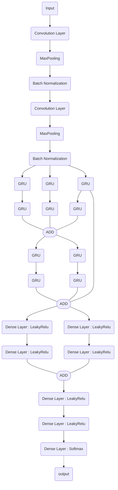
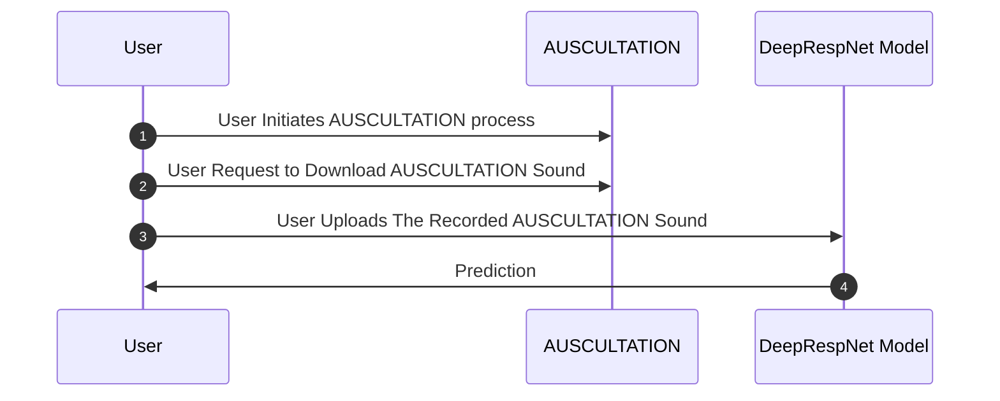

```mermaid
graph TD
  ip(Input):::green
  op(output):::green
  cl1( Convolution Layer)
  mp1( MaxPooling)
  bn1( Batch Normalization)
  cl2( Convolution Layer)
  mp2( MaxPooling)
  bn2( Batch Normalization)


  g( GRU )
  g1( GRU )
  g2( GRU )
  g3( GRU )
  g4( GRU )
  g5( GRU )
  g6( GRU )
  g7( GRU )
  g8( GRU )
  g9( GRU )
  a1([ ADD]):::yellow
  a2([ ADD]):::yellow
  a3([ ADD]):::yellow
  d(  Dense Layer : LeakyRelu)
  d1( Dense Layer : LeakyRelu)
  d2( Dense Layer : LeakyRelu)
  d3( Dense Layer : LeakyRelu)
  d4( Dense Layer : LeakyRelu)
  d5( Dense Layer : LeakyRelu)
  d6( Dense Layer : Softmax)
  ip --> cl1 --> mp1 --> bn1 --> cl2 
  cl2 --> mp2 --> bn2
  bn2 --> g
  bn2 --> g2
  bn2 --> g4
  g --> g1
  g2 --> g3
  g4 --> g5
  g5 --- a1
  g3 --- a1
  g1 --- a1
  a1 --> g6
  a1 --> g8
  g6 --> g7
  g8 --> g9
  g9 --- a2
  g7 --- a2
  g  --- a2
  a2 --> d
  a2 -->d2
  d --> d1
  d2 --> d3
  d1 --- a3
  d3 --- a3
  a3 --> d4
  d4 --> d5
  d5 --> d6
  d6 -.-> op
  

```

```mermaid
sequenceDiagram
    autonumber

    User->>AUSCULTATION: User Initiates AUSCULTATION process
    User->>AUSCULTATION: User Request to Download AUSCULTATION Sound
    User->>DeepRespNet Model: User Uploads The Recorded AUSCULTATION Sound
    DeepRespNet Model ->> User : Prediction


```